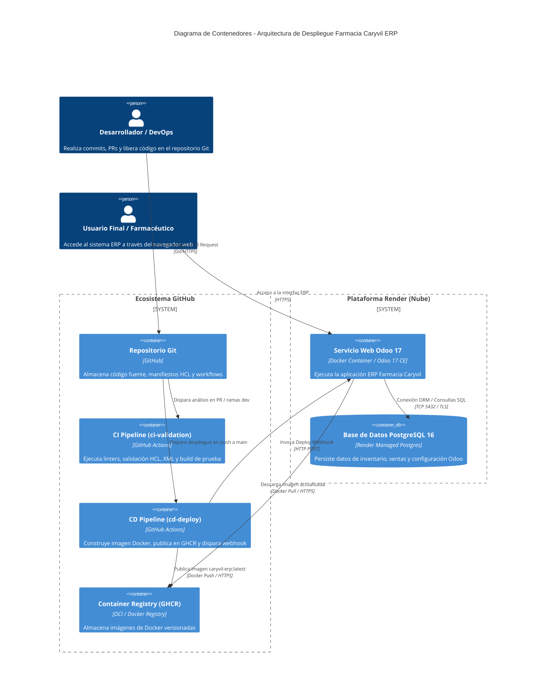
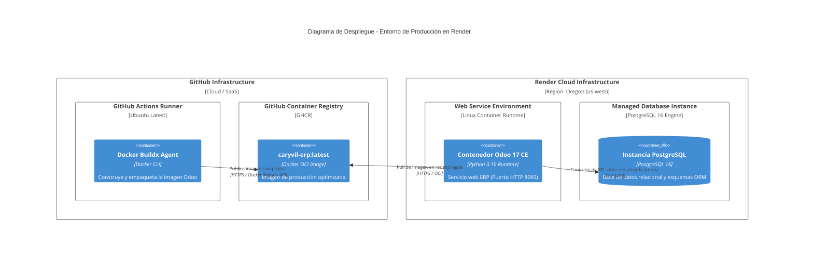
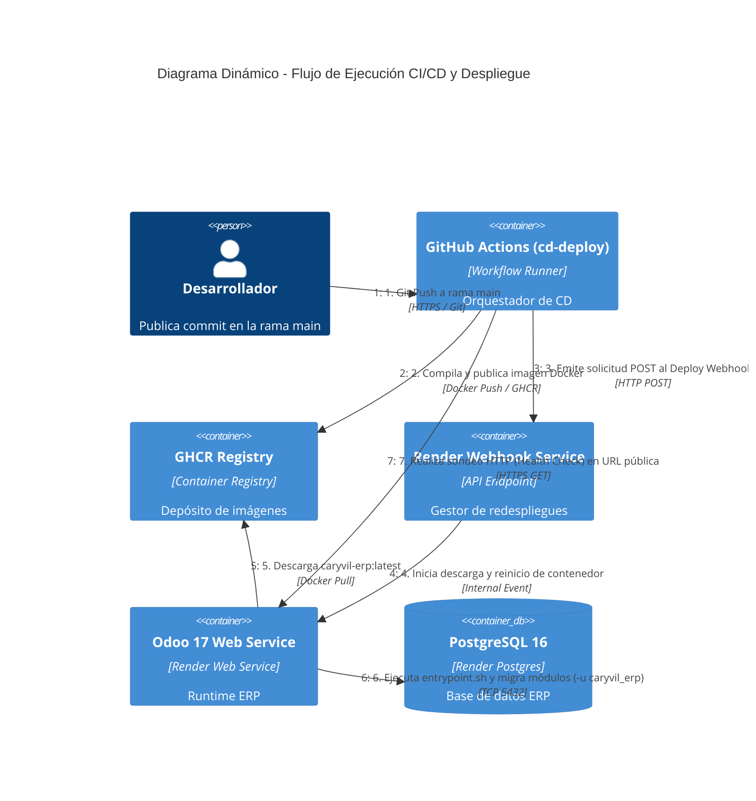

# Arquitectura y Flujo de Despliegue de Farmacia Caryvil ERP

## 1. Visión General

El proceso de despliegue de **Farmacia Caryvil ERP** implementa una canalización desacoplada y automatizada de Integración Continua y Despliegue Continuo (CI/CD), acompañada de Infraestructura como Código (IaC) gestionada con **Terraform** sobre el proveedor de nube **Render**.

> [!NOTE]
> **Entorno de Producción/Dev:** [https://caryvil-erp-dev.onrender.com](https://caryvil-erp-dev.onrender.com)
> **Registro de Contenedores:** GitHub Container Registry (`ghcr.io/mrtobar04/caryvil-erp`)

---

## 2. Diagrama de Contenedores de la Infraestructura (C4Container)

El siguiente diagrama representa los límites del sistema, servicios web, bases de datos y la orquestación de despliegue automatizado.



---

## 3. Infraestructura como Código (IaC con Terraform)

El aprovisionamiento de recursos en la nube se gestiona de forma declarativa mediante **Terraform** en la ruta `infra/terraform/`.

### Componentes Declarados (`main.tf`):
1. **Base de Datos Gestionada (`render_postgres.caryvil_db`):**
   - Motor: PostgreSQL 16.
   - Plan: Free / Región: Oregon (`us-west`).
2. **Servicio Web en Contenedor (`render_web_service.caryvil_odoo`):**
   - Origen de Runtime: Imagen Docker de GHCR (`ghcr.io/mrtobar04/caryvil-erp:latest`).
   - Inyección de Variables de Entorno:
     - `HOST`: Hostname privado interno de la BD extraído dinámicamente.
     - `DB_PORT`: Puerto 5432 (diferenciado del puerto reservado por Render para HTTP).
     - `USER` / `PASSWORD`: Credenciales provistas dinámicamente por la BD de Render.
     - `DB_NAME`: Nombre de la base de datos operativa (`caryvil_dev`).
     - `PROXY_MODE`: `True` para el funcionamiento correcto tras el Reverse Proxy de Render.
     - `ODOO_UPDATE_MODULES`: `caryvil_erp` para forzar la actualización idempotente de esquemas ORM en el arranque.

### Comandos de Gestión Terraform:
```bash
# Inicializar proveedores y backend
terraform -chdir=infra/terraform init

# Validar sintaxis y formato
terraform -chdir=infra/terraform fmt
terraform -chdir=infra/terraform validate

# Planificar y aplicar cambios de infraestructura
terraform -chdir=infra/terraform plan
terraform -chdir=infra/terraform apply
```

---

## 4. Diagrama de Despliegue (C4Deployment)

Representa la topología física y lógica de los nodos de infraestructura en ejecución.



---

## 5. Diagrama Dinámico de la Canalización CI/CD (C4Dynamic)

Detalla la secuencia numerada de eventos que ocurren desde que un desarrollador publica un cambio hasta la verificación de salud del servicio.



---

## 6. Variables y Secretos Requeridos en GitHub Actions

Para asegurar la ejecución correcta de las canalizaciones CI/CD, el repositorio de GitHub debe configurar los siguientes secretos (`Settings > Secrets and variables > Actions`):

| Secreto / Variable | Tipo | Descripción | Obligatorio |
|-------------------|------|-------------|-------------|
| `GITHUB_TOKEN` | Nativo | Token automático de GitHub para autenticar y publicar en GHCR | Sí (Automático) |
| `RENDER_DEPLOY_HOOK_URL` | Secret | URL del webhook de despliegue generado por Render para el Web Service | Sí |
| `RENDER_SERVICE_URL` | Secret / Var | URL pública del servicio desplegado (`https://caryvil-erp-dev.onrender.com`) | Sí (Opcional / Fallback nativo) |

---

## 7. Estrategia de Resiliencia y Mantenibilidad

- **Idempotencia de Base de Datos:** Cada arranque de contenedor invoca `entrypoint.sh`, el cual evalúa `ODOO_UPDATE_MODULES`. Si la variable está presente, ejecuta la actualización del módulo `caryvil_erp`, asegurando que nuevos campos o vistas se sincronicen automáticamente sin requerir intervención manual.
- **Concurrencia Controlada:** El pipeline `cd-deploy.yml` configura `cancel-in-progress: false` para evitar abortar despliegues en curso, garantizando la consistencia de las imágenes publicadas.
- **Recuperación en Capa Gratuita:** El paso final del pipeline incluye un algoritmo de retardo progresivo (sondeo de hasta 12 intentos espaciados por 15 segundos) para mitigar falsos positivos producidos por el reinicio de instancias (*cold start*) en la capa gratuita de Render.
