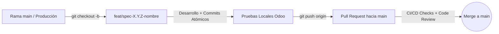
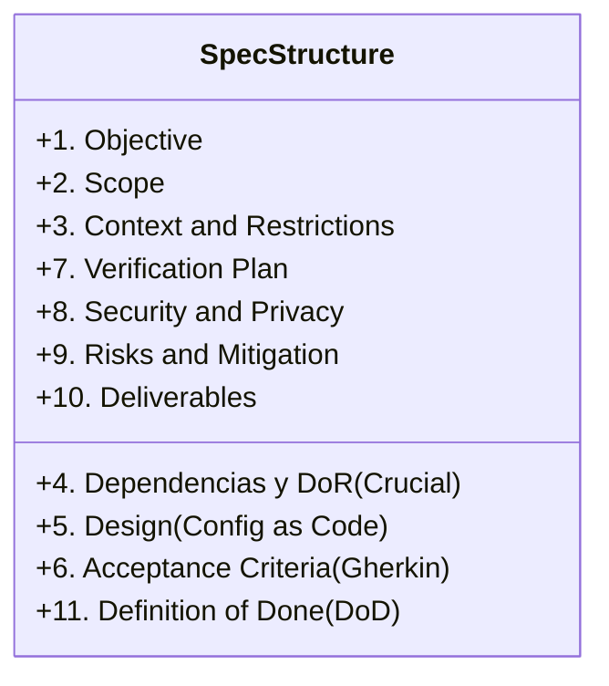

# Guía de Desarrollo Basado en Especificaciones (Spec Driven Development - SDD)
### Proyecto: Caryvil ERP (Odoo 17 Community & PostgreSQL 16)

---

## 1. Introducción y Filosofía SDD

En **Farmacia Caryvil ERP**, el desarrollo se rige bajo la metodología **Spec Driven Development (SDD)**. La premisa fundamental de esta filosofía es:

> **"El código es únicamente un subproducto de una especificación bien definida. Si un requerimiento, caso de borde o regla de negocio no está explícitamente documentado en la especificación (`spec`), no existe y no debe ser construido."**

### 1.1. Principios Clave
1. **Fuente Única de Verdad (Single Source of Truth):** Cada comportamiento del sistema debe nacer de un documento `spec-X.Y.Z-*.md`.
2. **Contexto Acotado (Bounded Context):** Cada especificación tiene fronteras claras e independientes para evitar colisiones de alcance (*scope collisions*).
3. **Taxonomía Jerárquica X.Y.Z:**
   * **`X` (Dominio Principal / Épica):** Módulos globales del negocio (ej. `2` Arquitectura Base, `7` Inventario y Farmacia, `8` Compras, `9` Ventas y POS).
   * **`Y` (Subdominio / Funcionalidad):** Flujos de trabajo específicos dentro de un dominio (ej. `7.3` Ajustes y Bajas de Inventario).
   * **`Z` (Unidad de Implementación / Tarea):** Elemento granular, ejecutable y testeable (ej. `7.3.1` Movimientos y Ajustes de Inventario).

---

## 2. Modelo de Ramas y Flujo Git

El repositorio cuenta con políticas estrictas de integración y despliegue continuo (CI/CD) para garantizar la estabilidad del sistema.

### 2.1. Política de la Rama `main`
* La rama `main` representa el estado de **Producción y Despliegue Continuo**.
* **PROHIBIDO realizar `git push` directo a `main`.** Todo cambio hacia `main` debe ingresar indefectiblemente mediante un **Pull Request (PR)** aprobado y con validaciones automáticas exitosas.

### 2.2. Convención de Nombres de Ramas
Todo desarrollo debe ejecutarse en una rama aislada creada a partir de la última versión de `main`:

| Tipo de Rama | Formato de Nomenclatura | Ejemplo | Descripción |
| :--- | :--- | :--- | :--- |
| **Especificación (Feature)** | `feat/spec-X.Y.Z-descripcion-corta` o `spec/X.Y.Z-descripcion-corta` | `feat/spec-7.3.1-ajustes-inventario` | Implementación de una unidad funcional de spec. |
| **Corrección de Errores** | `fix/descripcion-del-bug` | `fix/bloqueo-validacion-lote-nulo` | Corrección puntual de un defecto en código productivo. |
| **Mantenimiento / Tareas** | `chore/descripcion-tarea` | `chore/actualizar-dependencias-docker` | Ajustes de CI/CD, configuración o scripts. |
| **Documentación** | `docs/descripcion-documento` | `docs/guia-despliegue-render` | Actualización o adición de guías, ADRs o manuales. |
| **Pruebas** | `test/descripcion-prueba` | `test/suite-cobertura-facturacion` | Creación o refactorización de suites de prueba. |

### 2.3. Ciclo de Vida de una Rama


---

## 3. Convención de Commits Atómicos y Profesionales

En cumplimiento con la regla interna del proyecto (`commit-convention.md`), los desarrolladores deben mantener un historial limpio, trazable y **estrictamente atómico**.

### 3.1. Reglas de Oro
* **Atomicidad Absoluta:** Un commit debe representar **una única unidad lógica de cambio**. No se debe mezclar actualización de dependencias, cambios de vistas XML, modificaciones de modelos Python y pruebas en un solo commit monolítico.
* **Idioma:** Título y cuerpo redactados **en español** (a excepción de tecnicismos como ORM, SQL, JWT, etc.).
* **Sin Commits Monstruo:** Prohibido el uso indiscriminado de `git add .` cuando involucre múltiples contextos independientes.

### 3.2. Estructura Obligatoria
```text
tipo(<modulo>): Descripción breve en español, imperativa y de máximo 50 caracteres

- Detalles exhaustivos de la implementación.
- Decisiones técnicas importantes (por qué se resolvió de esta manera).
- Consecuencias, dependencias actualizadas o notas adicionales.
```

### 3.3. Tipos Permitidos
* `feat`: Introduce una nueva funcionalidad al código.
* `test`: Añade, actualiza o corrige pruebas automatizadas (unitarias, integración).
* `docs`: Cambios exclusivos en documentación (README, ADRs, manuales).
* `chore`: Tareas de mantenimiento, dependencias, Docker o CI/CD.
* `spec`: Creación o actualización de archivos de especificaciones (`specs/`).
* `fix`: Corrección de bugs o errores detectados.

### 3.4. Ejemplo de Commits Secuenciales Correctos
```text
feat(inventario): Implementar validación de motivo en ajustes de stock

- Se extendió el modelo stock.quant agregando el campo adjustment_reason obligatorio.
- Se sobreescribió action_apply_inventory para arrojar ValidationError si el motivo está vacío.
- Decisión técnica: Se fijó el valor por defecto en 'conteo_ciclico_periodico'.
```

```text
test(inventario): Agregar pruebas unitarias para validación de ajustes

- Se añadió test_stock_adjustment_validation_without_reason comprobando la excepción.
- Se validó el caso de éxito donde la cantidad ajustada actualiza correctamente stock.quant.
```

---

## 4. Convención y Plantilla de Pull Requests (PR)

Todo Pull Request enviado a `main` debe ser exhaustivo y proporcionar el contexto necesario para una revisión ágil y confiable.

### 4.1. Convención del Título del PR
* Formato: `[TIPO-O-SPEC] Descripción concisa del cambio`
* Ejemplos:
  * `[SPEC-7.3.1] Implementación de movimientos y ajustes de inventario con auditoría`
  * `[FIX] Corrección de cálculo de fracciones en punto de venta`
  * `[CHORE] Optimización de Dockerfile para despliegue en Render`

### 4.2. Plantilla Estándar de Pull Request
Al abrir un PR, se debe completar la siguiente estructura en el cuerpo de la solicitud:

```markdown
## Contexto & Objetivo
Breve resumen de los cambios introducidos y la necesidad del negocio que resuelven.
- **Spec / Issue Asociada:** `SPEC-X.Y.Z: Nombre de la Spec`

## Cambios Realizados
- [x] Extensión de modelo `modelo.odoo` con campos de auditoría.
- [x] Creación de vistas XML en `views/archivo_views.xml`.
- [x] Reglas de acceso añadidas en `ir.model.access.csv`.

## Verificación de Criterios (DoD)
- [x] Se revisó y cumplió el Definition of Ready (DoR) antes del inicio.
- [x] Código cumple con los lineamientos de estilo y arquitectura modular.
- [x] No se introdujeron datos duros (hardcoded) ni credenciales sensibles.
- [x] Criterios de Aceptación (Gherkin) de la spec validados y cumplidos al 100%.

## Pruebas Realizadas
### Pruebas Automatizadas
- Comando ejecutado: `docker exec -it odoo-container odoo -c /etc/odoo/odoo.conf -d caryvil_db -u caryvil_erp --test-enable --stop-after-init`
- Resultado: 0 errores / 0 fallos.

### Pruebas Manuales
- Pasos ejecutados según la sección 7 de la spec.
- Verificación de roles: Probado con usuario `Administrador` y usuario `Cajero/Inventario`.

## Evidencias
Adjuntar capturas de pantalla de la interfaz de Odoo, registros de logs o salidas de terminal que demuestren el funcionamiento esperado.

## Impacto y Consideraciones de Despliegue
- ¿Requiere actualización de módulo (`-u caryvil_erp`)?: [Sí / No]
- ¿Afecta datos existentes?: [Explicar migración si aplica]
```

---

## 5. Anatomía de una Especificación (Spec X.Y.Z)

Cada archivo de especificación ubicado en `specs/spec-X.Y.Z-[nombre].md` sigue una estructura estandarizada. A continuación se detalla el significado, relevancia y cómo debe interpretarse cada sección:



---

### 5.1. Importancia Crítica del Definition of Ready (DoR)
Antes de escribir una sola línea de código o crear una rama de trabajo, el desarrollador **DEBE auditar la sección 4 (Dependencias y DoR)** de la spec:

> **¿Qué es el DoR (Definition of Ready)?**  
> Es el contrato que valida que todos los prerrequisitos técnicos, definiciones de negocio, dependencias de otros specs y modelos previos están 100% listos y aprobados.
>
> **Regla de Desarrollo:**  
> Si algún ítem del DoR no está cumplido o las dependencias previas no han sido mergeadas a `main`, la spec **NO ESTÁ LISTA PARA CONSTRUIR**. El desarrollador debe solicitar el desbloqueo antes de iniciar.

---

### 5.2. Desglose Sección por Sección

#### `## 1. Objective`
* **Qué significa:** Declaración precisa e inequívoca del propósito funcional y técnico del módulo.
* **Por qué es relevante:** Establece las fronteras duras del componente. Si una funcionalidad no contribuye directamente al objetivo, está fuera de alcance.

#### `## 2. Scope (Alcance)`
* **2.1. Included:** Lista exhaustiva de modelos, campos, vistas, lógica de negocio y métodos que se van a construir.
* **2.2. Not Included (Out of Scope):** Lista explícita de casos y procesos que **no** deben resolverse en esta spec para evitar *scope creep* (e.g., bajas por vencimiento se atienden en `SPEC-7.3.2`, no en `SPEC-7.3.1`).
* **Por qué es relevante:** Previene que el desarrollador sobrediseñe o invada la responsabilidad de otros módulos.

#### `## 3. Context and Restrictions`
* **Qué significa:** Justificación de negocio en el entorno de Farmacia Caryvil y reglas técnicas inmutables (ej. Odoo 17 ORM, no modificar tablas core directamente, campos obligatorios condicionados).
* **Por qué es relevante:** Asegura que la solución técnica respete las particularidades del negocio y las limitaciones tecnológicas.

#### `## 4. Dependencias y Definición de Preparación (DoR)`
* **Dependencias Previas:** Specs previas que deben estar terminadas y fusionadas (ej. `SPEC-2.1.1` estructura base).
* **Definition of Ready (DoR):** Checklist de validaciones previas (definiciones de catálogos, aprobación de flujos por el cliente, etc.).
* **Por qué es relevante:** Evita retrabajo, callejones sin salida técnicos e inconsistencias en la base de datos.

#### `## 5. Design (Implementation Details)`
* **Qué significa:** Especificación técnica detallada: arquitectura de clases Python (`models/`), diseño de vistas XML (`views/`), nombres exactos de campos técnicos, tipos de datos y algoritmos de cálculo.
* **Por qué es relevante:** Elimina la ambigüedad en la codificación y garantiza que el equipo hable el mismo lenguaje técnico.

#### `## 6. Acceptance Criteria (Criterios de Aceptación)`
* **Qué significa:** Escenarios de prueba de negocio estructurados bajo la sintaxis **Gherkin**:
  * **Given (Dado):** Estado inicial del sistema y datos de prueba.
  * **When (Cuando):** Acción desencadenada por el usuario o evento.
  * **Then (Entonces):** Resultado esperado y validaciones comprobables.
* **Por qué es relevante:** Define con precisión matemática cuándo un requerimiento funciona correctamente.

#### `## 7. Verification Plan (Plan de Verificación)`
* **Automated Tests:** Pruebas unitarias o de integración a programar en Python (`tests/test_*.py`).
* **Manual Verification:** Guión paso a paso para probar el comportamiento en la interfaz gráfica de Odoo.
* **Por qué es relevante:** Asegura que cada cambio esté respaldado por pruebas reproducibles antes de llegar a revisión.

#### `## 8. Security and Privacy (Seguridad y Privacidad)`
* **Qué significa:** Definición de grupos de seguridad de Odoo (`res.groups`), listas de control de acceso (`ir.model.access.csv`) y reglas de registro (*record rules* `ir.rule`).
* **Por qué es relevante:** Protege la integridad de los datos de la farmacia, garantizando que solo los roles autorizados (e.g., Administrador vs Cajero) puedan ejecutar acciones críticas.

#### `## 9. Risks and Mitigation (Riesgos y Mitigación)`
* **Qué significa:** Identificación proactiva de posibles fallos operativos o de seguridad y las medidas técnicas adoptadas para neutralizarlos.
* **Por qué es relevante:** Fomenta la resiliencia del software y evita sorpresas en entornos productivos.

#### `## 10. Deliverables & Config as Code (Entregables)`
* **Qué significa:** Inventario exacto de rutas de archivos que deben crearse o modificarse dentro del módulo `custom_addons/caryvil_erp/`.
* **Por qué es relevante:** Facilita la auditoría del Pull Request asegurando que no queden archivos huérfanos o fuera de estándar.

#### `## 11. Definition of Done (DoD - Definición de Terminado)`
* **Qué significa:** Lista de verificación final con criterios innegociables para cerrar la spec: código implementado, pruebas pasadas al 100%, validación visual y conformidad con la administración.
* **Por qué es relevante:** Garantiza que una funcionalidad entregada esté realmente lista para producción sin deuda técnica oculta.

---

## 6. Guía Rápida para el Desarrollador (Paso a Paso)

Sigue este flujo secuencial en cada asignación:

1. **Revisar la Spec y Validar DoR:**
   * Abre `specs/spec-X.Y.Z-[nombre].md`.
   * Confirma que todas las dependencias y el checklist del DoR estén cumplidos.
2. **Crear la Rama de Trabajo:**
   ```bash
   git checkout main
   git pull origin main
   git checkout -b feat/spec-X.Y.Z-nombre-funcionalidad
   ```
3. **Desarrollar e Implementar según Sección 5 (Design):**
   * Modifica/crea los archivos listados en la Sección 10 (Deliverables).
   * Respeta los nombres de campos, vistas y reglas de seguridad.
4. **Ejecutar Pruebas Locales (Sección 6 y 7):**
   * Corre las suites de prueba de Odoo y valida los criterios Gherkin.
5. **Generar Commits Atómicos:**
   * Realiza commits modulares siguiendo la convención de `commit-convention.md`.
6. **Subir Rama y Abrir Pull Request:**
   ```bash
   git push origin feat/spec-X.Y.Z-nombre-funcionalidad
   ```
   * Completa la plantilla del PR con todos los campos y evidencias requeridas.
7. **Revisión y Aprobación:**
   * Corrige cualquier observación solicitada en el code review.
   * Tras la aprobación, se realiza el Merge a `main` y el despliegue automático se activa.
