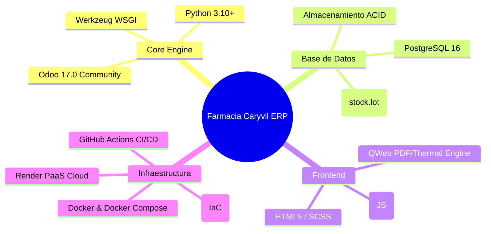

# Documentación de Arquitectura de Software - Farmacia Caryvil ERP

Bienvenido a la documentación oficial de arquitectura del sistema **Farmacia Caryvil ERP**. Esta documentación sigue el estándar del **Modelo C4** (*Context, Containers, Components, Deployment*) implementado mediante diagramas nativos en sintaxis **Mermaid**.

---

## 📌 Índice de Diagramas C4

| Nivel C4 | Documento | Audiencia Recomendada | Resumen del Contenido |
| :--- | :--- | :--- | :--- |
| **Nivel 1** | 📄 [Diagrama de Contexto (C4Context)](file:///d:/UDB/CICLO-10-2026/DES/PROYECTO/caryvil-erp/docs/architecture/c4-context.md) | Todos (Ejecutivos, PMs, Devs) | Visión global del sistema, actores (Farmacéutico, Gestor de Inventario, Admin), clientes y sistemas externos. |
| **Nivel 2** | 📄 [Diagrama de Contenedores (C4Container)](file:///d:/UDB/CICLO-10-2026/DES/PROYECTO/caryvil-erp/docs/architecture/c4-containers.md) | Arquitectos, Devs, DevOps | Aplicaciones ejecutables (Navegador OWL, Servidor Odoo 17, Addon `caryvil_erp`, Base de datos PostgreSQL 16). |
| **Nivel 3** | 📄 [Diagrama de Componentes (C4Component)](file:///d:/UDB/CICLO-10-2026/DES/PROYECTO/caryvil-erp/docs/architecture/c4-components-caryvil-erp.md) | Desarrolladores | Estructura interna del addon `caryvil_erp`: modelos ORM, controladores, validación DUI/NIT, reglas FEFO, QWeb y widgets OWL. |
| **Nivel 4** | 📄 [Diagrama de Despliegue (C4Deployment)](file:///d:/UDB/CICLO-10-2026/DES/PROYECTO/caryvil-erp/docs/architecture/c4-deployment.md) | DevOps, SysAdmins | Infraestructura local (Docker Compose) y de producción en Render Cloud aprovisionada con Terraform (IaC). |
| **Dinámico** | 📄 [Diagrama Dinámico (C4Dynamic)](file:///d:/UDB/CICLO-10-2026/DES/PROYECTO/caryvil-erp/docs/architecture/c4-dynamic-venta-farmaceutica.md) | Desarrolladores, QA | Flujo paso a paso numerado de venta de mostrador, validación de clientes, asignación de lotes FEFO e impresión de ticket 80mm. |

---

## 🛠️ Resumen de Stack Tecnológico

---

## 🔒 Principios Arquitectónicos y Cumplimiento

1. **Desacoplamiento y Modularidad (SDD):** Toda la lógica de negocio farmacéutico reside en el addon `custom_addons/caryvil_erp/`, garantizando que el núcleo de Odoo se mantenga limpio e instalable en actualizaciones.
2. **Cumplimiento Regulatorio Farmacéutico (FEFO):** Salida obligatoria de lotes priorizando la fecha de caducidad más cercana (*First Expired, First Out*), integrando gestión de mermas y desecho seguro.
3. **Localización y Fiscalización Salvadoreña:** Validación sintáctica estricta de documentos de identidad salvadoreños (DUI/NIT), desglose del 13% de IVA y formateo de impresión de tickets térmicos en 80mm.
4. **Seguridad y Control de Acceso por Roles (RBAC):** Definición estricta de grupos de seguridad nativos y reglas de acceso a nivel de registro (*record rules*) para proteger la información operativa y financiera.
