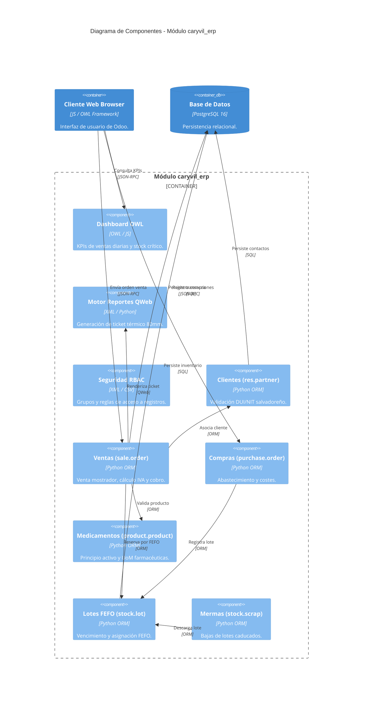

# Diagrama C4 - Nivel 3: Componentes del Addon caryvil_erp (Component Diagram)

Este documento describe la estructura interna de componentes del módulo `caryvil_erp`, ilustrando cómo se relacionan los modelos ORM, controladores HTTP, vistas OWL y motores de reportes dentro del contenedor del servidor Odoo.

## Diagrama de Componentes C4

## Descripción de Componentes Internos

### 1. Componentes de Presentación y Reportes
- **Dashboard OWL (`caryvil_sales_dashboard.js`):** Componente reactivo en OWL para la visualización de indicadores operativos (ventas del día, categorías con mayor rotación y alertas de lotes por caducar en 30/60 días).
- **Motor Reportes QWeb (`report_invoice_ticket.xml`):** Plantilla optimizada para rollos térmicos estándar de 80mm con desglose legal del IVA (13%) y encabezado fiscal.
- **Seguridad RBAC (`caryvil_security.xml`, `ir.model.access.csv`):** Matriz de permisos segmentada por roles (Cajero, Farmacéutico, Gestor de Inventario, Administrador).

### 2. Capa de Modelos Transaccionales
- **Clientes y Proveedores (`res.partner`):** Validador con algoritmo de comprobación para DUI (`00000000-0`) y NIT, además de segmentación de clientes comerciales y Consumidor Final.
- **Ventas de Mostrador (`sale.order`):** Flujo ágil para venta en caja, confirmación inmediata, cálculo de impuestos salvadoreños y generación de salida de almacén.
- **Compras y Abastecimiento (`purchase.order`):** Órdenes de reabastecimiento con proveedores, captura de costos unitarios netos y recepción de mercancía.

### 3. Capa de Inventario y Trazabilidad Farmacéutica
- **Medicamentos (`product.product`):** Catálogo especializado con atributos de principio activo, concentración, registro sanitario y jerarquía de unidades fraccionadas (Caja, Blíster, Unidad).
- **Lotes y FEFO (`stock.lot`):** Núcleo de trazabilidad sanitaria. Aplica la estrategia *First Expired, First Out* garantizando el despacho prioritario de productos próximos a vencer.
- **Mermas (`stock.scrap`):** Registro de bajas controladas por caducidad o deterioro físico con destino a ubicaciones de desecho farmacéutico.
