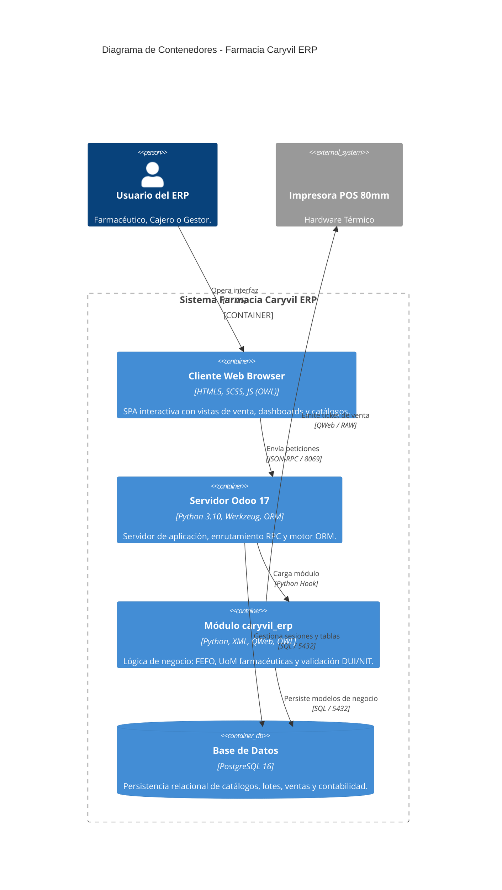

# Diagrama C4 - Nivel 2: Contenedores (Container Diagram)

Este documento detalla la arquitectura de contenedores de software de **Farmacia Caryvil ERP**, ilustrando las aplicaciones ejecutables, almacenes de datos y protocolos de comunicación entre los límites del sistema.

## Diagrama de Contenedores C4

## Descripción de Contenedores

### 1. Cliente Web Browser (Frontend OWL)
- **Tecnología:** JavaScript (OWL Framework de Odoo 17), HTML5, SCSS.
- **Responsabilidad:** Presentación interactiva para el usuario. Incorpora widgets personalizados como `caryvil_sales_dashboard.js` (KPIs en tiempo real), `masked_char_field.js` (máscaras para DUI/NIT) y `purchase_live_totals.js`.

### 2. Servidor de Aplicaciones Odoo (Runtime Python)
- **Tecnología:** Python 3.10+, Werkzeug WSGI, Motor ORM de Odoo 17.0.
- **Responsabilidad:** Procesamiento de solicitudes HTTP/RPC, control transaccional ACID, gestión de permisos a nivel de modelo/registro y compilación de plantillas QWeb.

### 3. Módulo de Negocio `caryvil_erp` (Custom Addon)
- **Tecnología:** Python, XML (Views/Data), QWeb (Reports), JS/XML (OWL Assets).
- **Responsabilidad:** Lógica farmacéutica especializada:
  - **Estrategia FEFO (`pharmacy_removal_strategy_data.xml`):** Despacho prioritario del lote con fecha de caducidad más cercana.
  - **Unidades de Medida Farmacéuticas (`pharmacy_uom_data.xml`):** Jerarquía de Caja, Blíster y Unidad/Pastilla.
  - **Validación de Identidad Salvadoreña:** Verificación sintáctica y módulo 10 para DUI (`00000000-0`) y formato de NIT.
  - **Tickets Térmicos:** Formato estrecho de 80mm optimizado para impresión rápida.

### 4. Base de Datos PostgreSQL 16 (Persistence Storage)
- **Tecnología:** PostgreSQL 16.x.
- **Responsabilidad:** Almacenamiento relacional de tablas principales (`res_partner`, `product_template`, `stock_lot`, `stock_quant`, `sale_order`, `purchase_order`, `account_move`).
