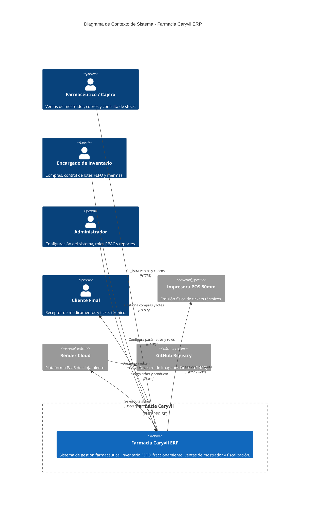

# Diagrama C4 - Nivel 1: Contexto del Sistema (System Context)

Este documento describe la vista de alto nivel del sistema **Farmacia Caryvil ERP**, identificando sus usuarios principales, el sistema central y las interacciones con sistemas externos y la infraestructura de soporte.

## Diagrama de Contexto C4

## Descripción de Componentes y Actores

### Actores Internos (Usuarios del Sistema)
- **Farmacéutico / Cajero:** Atención rápida en mostrador, búsqueda ágil de medicamentos por nombre o principio activo, validación de clientes por DUI/NIT y cobro de tickets.
- **Encargado de Inventario / Compras:** Reabastecimiento, recepción de órdenes con asignación de lotes y fechas de expiración (FEFO), monitoreo de caducidades y gestión de mermas.
- **Administrador del Sistema:** Gestión de permisos RBAC, configuración de impuestos (IVA 13%), listas de precios de proveedores y dashboards ejecutivos.

### Sistema Central
- **Farmacia Caryvil ERP:** Basado en **Odoo 17.0 Community Edition** sobre Python 3.10. Integra módulos estándar extendidos (`stock`, `purchase`, `sale_management`, `account`, `product_expiry`) y el addon `caryvil_erp` para trazabilidad y normativa salvadoreña.

### Dispositivos y Servicios Externos
- **Impresora POS 80mm:** Impresión de tickets de venta en formato angosto optimizado.
- **Render Cloud Platform:** Alojamiento PaaS para el contenedor Odoo y la base de datos PostgreSQL 16.
- **GitHub Container Registry (GHCR):** Registro de imágenes Docker compiladas por CI/CD.
