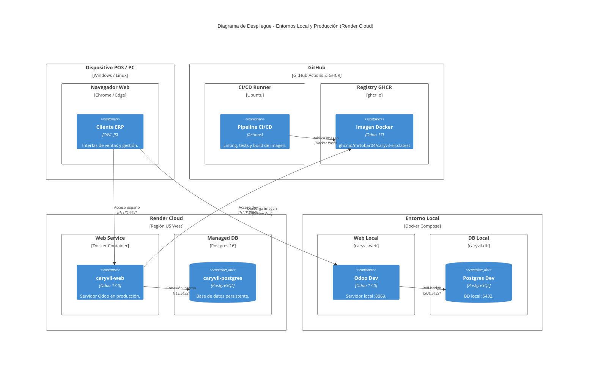

# Diagrama C4 - Nivel 4: Despliegue (Deployment Diagram)

Este documento ilustra la arquitectura de infraestructura física y virtualizada donde se despliega **Farmacia Caryvil ERP**, abarcando tanto el entorno de desarrollo local orquestado con Docker Compose como la infraestructura cloud de producción aprovisionada en Render mediante Terraform.

## Diagrama de Despliegue C4

## Infraestructura como Código (IaC con Terraform)

El aprovisionamiento de la infraestructura en producción está automatizado mediante **Terraform** dentro del directorio `infra/terraform/`:

1. **`render_postgres.caryvil_db`**: Instancia gestionada de PostgreSQL 16 en Render con aprovisionamiento automatizado y almacenamiento persistente.
2. **`render_web_service.caryvil_odoo`**: Contenedor basado en la imagen inmutable de GHCR.
   - **Inyección de Secretos:** Configura `HOST`, `USER`, `PASSWORD`, `DB_NAME` y `ADMIN_PASSWORD` desde variables de entorno.
   - **Reverse Proxy:** Habilita `PROXY_MODE=True` para manejar de forma segura las terminaciones TLS.
   - **Actualización Automática:** Emplea `ODOO_UPDATE_MODULES=caryvil_erp` para aplicar migraciones de esquema (`ALTER TABLE`) de forma idempotente durante el arranque.

## Entorno Local (Docker Compose)

En local (`infra/compose/docker-compose.yml`), los servicios se comunican a través de la red `caryvil_network`:
- **`caryvil-db`**: Contenedor `postgres:16-alpine` con healthcheck activo.
- **`caryvil-web`**: Contenedor Odoo 17 con volumen montado para desarrollo ágil en `/mnt/extra-addons`.
