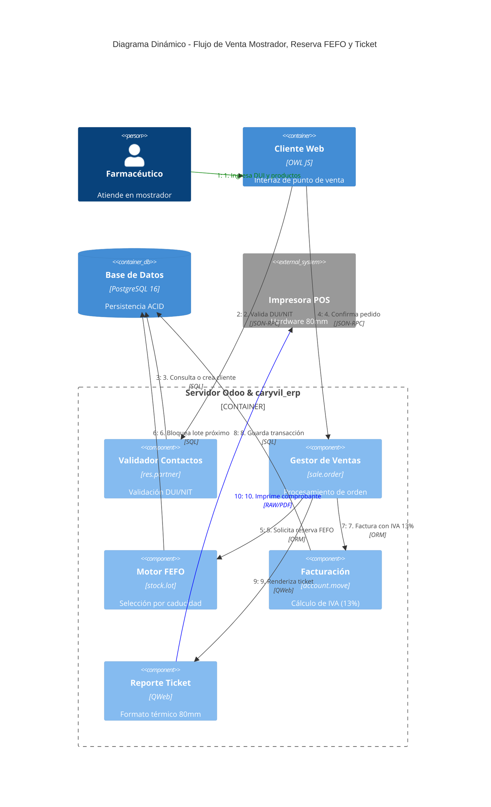

# Diagrama C4 - Dinámico: Flujo de Venta Farmacéutica de Mostrador (Dynamic Diagram)

Este documento ilustra la secuencia de interacciones numeradas y paso a paso durante el proceso de procesamiento de una venta de mostrador, validación de clientes por DUI/NIT, reserva de lotes por FEFO y la emisión del ticket térmico de 80mm en **Farmacia Caryvil ERP**.

## Diagrama Dinámico C4

## Traza Detallada de la Transacción

1. **Búsqueda y Selección de Cliente (Pasos 1-3):**
   - El farmacéutico ingresa el número de documento del cliente en el campo formateado con máscara (`masked_char_field.js`).
   - El componente ejecuta una consulta RPC hacia `res.partner`. Si no se localiza un registro previo y es una compra al menudeo, se asigna el perfil **Consumidor Final**.

2. **Verificación de Stock y Asignación FEFO (Pasos 4-6):**
   - Al registrar las líneas de venta, `sale.order.line` evalúa la existencia en inventario.
   - La regla de remoción **FEFO** (`pharmacy_removal_strategy_data.xml`) inspecciona `stock.quant` y `stock.lot`.
   - Se reservan de manera automática los quants del lote cuya fecha de caducidad (`expiration_date`) sea la más próxima.

3. **Confirmación, Facturación y Asiento Contable (Pasos 7-8):**
   - Al completar el cobro, la orden pasa a estado `sale`, actualizando las salidas en `stock.picking` y generando la factura `account.move`.
   - Se calcula el 13% de IVA salvadoreño sobre el subtotal gravable.

4. **Renderizado y Salida del Ticket Térmico (Pasos 9-10):**
   - Se dispara la plantilla QWeb `report_invoice_ticket.xml`.
   - La plantilla formatea el documento con un ancho exacto de 80mm, incluyendo el membrete de Farmacia Caryvil, número correlativo de comprobante, desglose de lotes y total cobrado.
   - El flujo se envía directamente a la impresora térmica POS.
