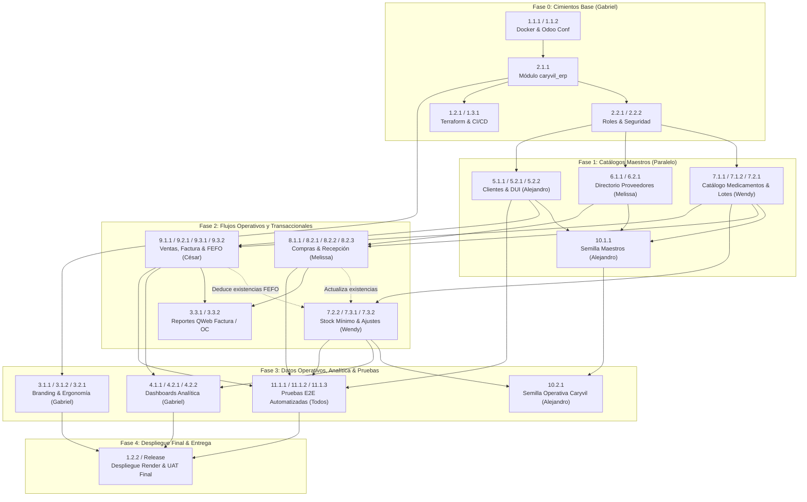

# Plan de Desarrollo del Proyecto: ERP Farmacia Caryvil
## Metodología Spec-Driven Development (SDD) — Plazo de Ejecución: 2 Semanas (14 Días)

---

## 1. Resumen Ejecutivo y Objetivos

El presente **Plan de Desarrollo** establece la hoja de ruta técnica, operativa y de gestión para la construcción e implantación del sistema ERP personalizado sobre **Odoo Community Edition** para **Farmacia Caryvil** (Soyapango, San Salvador). 

Bajo el marco de **Spec-Driven Development (SDD)**, el código fuente es un subproducto directo de especificaciones técnicas atómicas, medibles y no ambiguas organizadas bajo la taxonomía jerárquica **X.Y.Z**. Cada entrega funcional, regla de negocio, migración y prueba está directamente vinculada a su respectivo archivo de especificación en el directorio `specs/`.

### 1.1 Metas Clave del Proyecto
* **Centralización Operativa:** Unificar inventario con control de lotes y caducidad, abastecimiento formal, ventas de mostrador con facturación simple (IVA 13%) y directorio de clientes salvadoreños (validación DUI).
* **Despacho Inteligente FEFO:** Deducción automatizada de existencias priorizando lotes con fecha de vencimiento más próxima (*First Expired, First Out*).
* **Infraestructura Moderna en la Nube:** Aprovisionamiento reproducible con **Terraform** en **Render** (Web Service Odoo + PostgreSQL) y pipeline de CI/CD automatizado mediante **GitHub Actions**.
* **Plazo de Entrega Improrrogable:** 2 semanas calendario (14 días de desarrollo continuo, pruebas y despliegue final).

---

## 2. Estructura del Equipo y Matriz de Asignaciones

El equipo de desarrollo se organiza en roles de dominio funcional con responsabilidades claras sobre los 40 componentes especificados en el proyecto.

```
                               ┌────────────────────────────────────────┐
                               │       Gabriel Tobar (Líder / DevOps)   │
                               │ Infraestructura, CI/CD, Arquitectura,  │
                               │ Seguridad, Dashboards, UI/UX, Specs QA │
                               └──────────────────┬─────────────────────┘
                                                  │
         ┌───────────────────────┬────────────────┴──────────────────────┬───────────────────────┐
         ▼                       ▼                                       ▼                       ▼
┌─────────────────┐     ┌─────────────────┐                     ┌─────────────────┐     ┌─────────────────┐
│  Wendy Aguilar  │     │ Melissa Flores  │                     │  César Guzmán   │     │Alejandro Hernán.│
│    Inventario   │     │    Compras &    │                     │    Ventas &     │     │   Clientes &    │
│ & Medicamentos  │     │   Proveedores   │                     │   Facturación   │     │  Datos Semilla  │
└─────────────────┘     └─────────────────┘                     └─────────────────┘     └─────────────────┘
```

### 2.1 Perfil de Asignaciones por Integrante

| Integrante | Rol en el Proyecto | Dominio Principal Asignado | Specs Específicos a Cargo |
| :--- | :--- | :--- | :--- |
| **Gabriel Tobar** | Tech Lead, DevOps & Arquitecto SDD | Infraestructura, CI/CD, Arquitectura Base, Seguridad, UI/UX Global, Dashboards y Coordinación de Pruebas | `spec-1.1.1`, `spec-1.1.2`, `spec-1.2.1`, `spec-1.2.2`, `spec-1.3.1`, `spec-2.1.1`, `spec-2.2.1`, `spec-2.2.2`, `spec-3.1.1`, `spec-3.1.2`, `spec-3.2.1`, `spec-4.1.1`, `spec-4.2.1`, `spec-4.2.2`, `spec-11.1.1` *(CI)*, `spec-11.1.2` *(CI)*, `spec-11.1.3` *(CI)* |
| **Wendy Aguilar** | Desarrolladora Backend & Dominio Inventario | Módulo de Inventario y Medicamentos Farmacéuticos | `spec-7.1.1`, `spec-7.1.2`, `spec-7.2.1`, `spec-7.2.2`, `spec-7.3.1`, `spec-7.3.2` |
| **Melissa Flores** | Desarrolladora Backend & Flujo Abastecimiento | Módulo de Compras, Recepción y Directorio de Proveedores | `spec-6.1.1`, `spec-6.2.1`, `spec-8.1.1`, `spec-8.2.1`, `spec-8.2.2`, `spec-8.2.3`, `spec-3.3.2` *(Reporte OC)* |
| **César Guzmán** | Desarrollador Backend & Flujo de Caja | Módulo de Ventas, Facturación Simple y Estrategia FEFO | `spec-9.1.1`, `spec-9.2.1`, `spec-9.3.1`, `spec-9.3.2`, `spec-3.3.1` *(Reporte Factura)* |
| **Alejandro Hernández** | Desarrollador Backend & Gestión de Datos | Módulo de Clientes y Creación/Migración de Datos Semilla | `spec-5.1.1`, `spec-5.2.1`, `spec-5.2.2`, `spec-10.1.1`, `spec-10.2.1` |

---

## 3. Grafo de Dependencias Técnicas entre Especificaciones

La naturaleza de un sistema ERP exige una secuencia estricta de implementación para evitar bloqueos entre desarrolladores. La infraestructura y el scaffolding base habilitan los modelos de datos; los modelos maestros habilitan las transacciones; y las transacciones alimentan los dashboards y pruebas integrales.



---

## 4. Cronograma de Ejecución: Sprint Plan de 2 Semanas

El período de 14 días se divide en 4 iteraciones estructuradas con hitos de validación claros (*milestones*).

```
Día:  01  02  03  04  05  06  07  08  09  10  11  12  13  14
      [== Fase 0 ==]
              [======= Fase 1 =======]
                      [======== Fase 2 =======]
                                      [====== Fase 3 ======]
                                                      [= F4 =]
```

### 4.1 Desglose Día por Día

#### Fase 0: Cimientos Técnicos, Arquitectura y Pipeline CI/CD (Días 1 - 2)
* **Objetivo:** Disponer del entorno Docker funcional, módulo base `caryvil_erp`, configuración de seguridad y pipeline automatizado en GitHub Actions.
* **Actividades y Specs:**
  * **Gabriel:**
    * Validar entorno Docker Compose local (`spec-1.1.1`).
    * Configurar `odoo.conf` y árbol de addons (`spec-1.1.2`).
    * Crear scaffolding del módulo `caryvil_erp` y `__manifest__.py` (`spec-2.1.1`).
    * Configurar roles base de usuario: Administrador, Cajero, Encargado de Farmacia (`spec-2.2.1`).
    * Configurar pipeline en GitHub Actions con linter y ejecución de pruebas (`spec-1.3.1`).
    * Preparar infraestructura como código con Terraform para Render (`spec-1.2.1`).
  * **Equipo (Wendy, Melissa, César, Alejandro):**
    * Clonación de repositorio, configuración del entorno Docker local e inducción al flujo de ramas git SDD.
* **Hito de Salida M0:** Contenedores Odoo + PostgreSQL arriba, módulo `caryvil_erp` instalable y CI/CD en verde.

---

#### Fase 1: Catálogos Maestros, Validación de Datos y Modelos Base (Días 3 - 5)
* **Objetivo:** Construir los modelos de datos fundamentales para medicamentos, lotes, proveedores y clientes.
* **Actividades y Specs:**
  * **Wendy (Inventario):**
    * Implementar catálogo farmacéutico con campos específicos: principio activo, presentación, concentración, código de barras y categorías (`spec-7.1.1`).
    * Configurar unidades de medida farmacéuticas (caja, blíster, frasco, unidad) (`spec-7.1.2`).
    * Configurar modelo de lotes con fecha de caducidad obligatoria (`spec-7.2.1`).
  * **Melissa (Proveedores):**
    * Implementar directorio de laboratorios y proveedores con NIT, NRC, teléfonos y términos de pago (`spec-6.1.1`).
    * Implementar catálogo de precios y códigos de referencia de proveedor (`spec-6.2.1`).
  * **Alejandro (Clientes & Datos Semilla):**
    * Implementar modelo de clientes con validación estricta de formato DUI salvadoreño (`00000000-0`) y datos de contacto (`spec-5.1.1`).
    * Implementar vistas de búsqueda ágil de clientes para mostrador (`spec-5.2.1`).
    * Implementar vista y tab de historial de compras por cliente (`spec-5.2.2`).
    * Construir archivo de datos semilla maestros: empresa, moneda USD, IVA 13% y categorías terapéuticas (`spec-10.1.1`).
  * **Gabriel (DevOps & UI):**
    * Implementar reglas de acceso `ir.model.access.csv` y reglas de registro `ir.rule` para los nuevos modelos (`spec-2.2.2`).
    * Aplicar paleta de color institucional Caryvil (Azul `#0056B3` / Verde `#28A745`) y estilos del tema (`spec-3.1.1`).
    * Personalizar pantalla de login con branding oficial (`spec-3.1.2`).
* **Hito de Salida M1:** Modelos maestros creados, validados por pruebas unitarias locales e integrados en la base de datos de desarrollo.

---

#### Fase 2: Flujos Operativos Transaccionales y Reglas de Negocio (Días 6 - 9)
* **Objetivo:** Implementar los ciclos completos de compras, recepción con lote, ventas en mostrador, despacho FEFO y facturación simple.
* **Actividades y Specs:**
  * **Melissa (Compras & Recepción):**
    * Desarrollar ciclo de vida de órdenes de compra a laboratorios con desglose de costos e IVA 13% (`spec-8.1.1`).
    * Implementar flujo de recepción de mercadería con captura obligatoria de lote y fecha de vencimiento (`spec-8.2.1`).
    * Implementar actualización automática e inmediata de existencias al confirmar recepción (`spec-8.2.2`).
    * Desarrollar mecanismo de control de discrepancias y recepciones parciales (`spec-8.2.3`).
    * Diseñar plantilla QWeb para orden de compra impresa (`spec-3.3.2`).
  * **Wendy (Reglas de Inventario & Mermas):**
    * Configurar reglas de reabastecimiento automático y cálculo de alertas de stock mínimo (`spec-7.2.2`).
    * Implementar interfaz de ajustes físicos y conciliación de inventario (`spec-7.3.1`).
    * Implementar gestión de mermas y bajas de medicamentos caducados/deteriorados (`spec-7.3.2`).
  * **César (Ventas, FEFO & Facturación):**
    * Implementar interfaz ágil de registro de ventas en mostrador con escaneo de código de barras y búsqueda por principio activo (`spec-9.1.1`).
    * Desarrollar generador de factura simple a consumidor final con cálculo automático de IVA 13% y numeración correlativa (`spec-9.2.1`).
    * Implementar deducción automática de stock en tiempo real al confirmar la venta (`spec-9.3.1`).
    * Desarrollar algoritmo de selección inteligente de lotes por política FEFO (*First Expired, First Out*) (`spec-9.3.2`).
    * Diseñar plantilla QWeb de ticket/factura para consumidor final (`spec-3.3.1`).
* **Hito de Salida M2:** Flujo de Compras -> Entrada de Lote -> Venta Mostrador con Despacho FEFO -> Salida de Lote -> Factura funcionando de punta a punta.

---

#### Fase 3: Analítica Gerencial, Semilla Operativa y Pruebas Automatizadas E2E (Días 10 - 12)
* **Objetivo:** Cargar catálogo real de medicamentos con existencias de prueba, construir paneles gerenciales y ejecutar la suite completa de pruebas automatizadas.
* **Actividades y Specs:**
  * **Alejandro (Datos Semilla Operativos):**
    * Preparar y cargar lote de datos representativos de medicamentos de Farmacia Caryvil con stocks iniciales, lotes diferenciados y fechas de vencimiento reales (`spec-10.2.1`).
    * Cargar proveedores y clientes muestra salvadoreños con DUI válidos (`spec-10.2.1`).
  * **Gabriel (Dashboards & Ergonomía):**
    * Optimizar navegación y menús ergonómicos para mostrador (`spec-3.2.1`).
    * Construir dashboard gerencial de KPIs de ventas diarias, ticket promedio y acumulados (`spec-4.1.1`).
    * Construir dashboard de alertas de stock crítico por debajo del mínimo (`spec-4.2.1`).
    * Construir dashboard de alertas tempranas de medicamentos por vencer a 30, 60 y 90 días (`spec-4.2.2`).
  * **Gabriel + Todo el Equipo (Pruebas Automatizadas):**
    * Automatizar prueba de integración del flujo de compras e inventario (`spec-11.1.1` - Melissa & Gabriel).
    * Automatizar prueba de integración del flujo de ventas con salida FEFO y facturación (`spec-11.1.2` - César & Gabriel).
    * Automatizar pruebas unitarias de validación DUI, cálculo de IVA y prevención de stock negativo (`spec-11.1.3` - Alejandro, Wendy & Gabriel).
* **Hito de Salida M3:** Cobertura de pruebas completa en CI/CD, base de datos cargada con catálogo representativo y dashboards analíticos en tiempo real.

---

#### Fase 4: Despliegue en Producción, Auditoría SDD y Entrega Final (Días 13 - 14)
* **Objetivo:** Desplegar en la nube de Render, auditar el cumplimiento del 100% de los specs, ejecutar pruebas de aceptación con usuario (UAT) y generar documentación de cierre.
* **Actividades y Specs:**
  * **Gabriel (DevOps & Release):**
    * Configurar variables de entorno de producción y secretos en Render (`spec-1.2.2`).
    * Ejecutar aprovisionamiento y despliegue final mediante Terraform y GitHub Actions (`spec-1.2.1`, `spec-1.3.1`).
    * Realizar auditoría de cumplimiento contra cada uno de los 40 specs (`spec-plan.md`).
    * Redactar guías de administración, runbooks de soporte y manuales de usuario.
  * **Todo el Equipo:**
    * Realizar pruebas cruzadas de aceptación de usuario (UAT) en el entorno de producción.
    * Corrección de bugs menores o ajustes visuales finales.
* **Hito de Salida M4:** Sistema en producción en Render accesible vía web, datos semilla cargados, 100% de specs completados y documentación de entrega lista.

---

## 5. Matriz Detallada de Asignación de Specs (SDD Traceability Matrix)

| ID Spec | Título de la Especificación | Responsable Principal | Revisor Técnico | Dependencia Previa | Fase / Días |
| :--- | :--- | :--- | :--- | :--- | :--- |
| `spec-1.1.1` | Configuración Entorno Docker | Gabriel Tobar | Equipo | Ninguna | Fase 0 (Días 1-2) |
| `spec-1.1.2` | Configuración Servidor Odoo (`odoo.conf`) | Gabriel Tobar | Equipo | `spec-1.1.1` | Fase 0 (Días 1-2) |
| `spec-1.2.1` | Aprovisionamiento Render con Terraform | Gabriel Tobar | Alejandro H. | `spec-1.1.1` | Fase 0 (Días 1-2) |
| `spec-1.2.2` | Gestión Variables de Entorno y Secretos | Gabriel Tobar | Melissa F. | `spec-1.2.1` | Fase 4 (Día 13) |
| `spec-1.3.1` | Pipeline CI/CD con GitHub Actions | Gabriel Tobar | César G. | `spec-1.1.1` | Fase 0 (Días 1-2) |
| `spec-2.1.1` | Estructura Módulo Custom `caryvil_erp` | Gabriel Tobar | Wendy A. | `spec-1.1.2` | Fase 0 (Días 1-2) |
| `spec-2.2.1` | Definición de Roles y Grupos de Usuarios | Gabriel Tobar | Melissa F. | `spec-2.1.1` | Fase 0 (Días 1-2) |
| `spec-2.2.2` | Reglas de Acceso y Seguridad de Modelos | Gabriel Tobar | César G. | `spec-2.2.1`, Modelos F1 | Fase 1 (Días 4-5) |
| `spec-3.1.1` | Personalización de Marca y Tema Odoo | Gabriel Tobar | Wendy A. | `spec-2.1.1` | Fase 1 (Días 4-5) |
| `spec-3.1.2` | Personalización Pantalla Autenticación | Gabriel Tobar | Alejandro H. | `spec-3.1.1` | Fase 1 (Días 4-5) |
| `spec-3.2.1` | Ergonomía y Navegación de Menús | Gabriel Tobar | César G. | Menús F1/F2 | Fase 3 (Días 10-11) |
| `spec-3.3.1` | Plantilla Reporte Factura / Ticket QWeb | César Guzmán | Gabriel Tobar | `spec-9.2.1` | Fase 2 (Días 8-9) |
| `spec-3.3.2` | Plantilla Reporte Orden de Compra QWeb | Melissa Flores | Gabriel Tobar | `spec-8.1.1` | Fase 2 (Días 8-9) |
| `spec-4.1.1` | Dashboard KPIs de Ventas en Tiempo Real | Gabriel Tobar | César G. | `spec-9.1.1`, `spec-9.2.1` | Fase 3 (Días 10-11) |
| `spec-4.2.1` | Dashboard Alertas Stock Crítico | Gabriel Tobar | Wendy A. | `spec-7.2.2` | Fase 3 (Días 11-12) |
| `spec-4.2.2` | Dashboard Alertas Vencimiento de Lotes | Gabriel Tobar | Wendy A. | `spec-7.2.1` | Fase 3 (Días 11-12) |
| `spec-5.1.1` | Gestión Perfil Clientes y Validación DUI | Alejandro Hernández | Gabriel Tobar | `spec-2.1.1` | Fase 1 (Días 3-4) |
| `spec-5.2.1` | Búsqueda Rápida de Clientes en Caja | Alejandro Hernández | César G. | `spec-5.1.1` | Fase 1 (Días 4-5) |
| `spec-5.2.2` | Historial de Compras de Clientes | Alejandro Hernández | César G. | `spec-5.1.1`, `spec-9.1.1` | Fase 2 (Días 8-9) |
| `spec-6.1.1` | Directorio y Gestión de Proveedores | Melissa Flores | Gabriel Tobar | `spec-2.1.1` | Fase 1 (Días 3-4) |
| `spec-6.2.1` | Catálogo de Precios de Proveedores | Melissa Flores | Wendy A. | `spec-6.1.1`, `spec-7.1.1` | Fase 1 (Días 4-5) |
| `spec-7.1.1` | Catálogo Farmacéutico de Medicamentos | Wendy Aguilar | Gabriel Tobar | `spec-2.1.1` | Fase 1 (Días 3-4) |
| `spec-7.1.2` | Unidades de Medida Farmacéuticas | Wendy Aguilar | Melissa F. | `spec-7.1.1` | Fase 1 (Días 4-5) |
| `spec-7.2.1` | Control Stock, Lotes y Vencimientos | Wendy Aguilar | César G. | `spec-7.1.1` | Fase 1 (Días 4-5) |
| `spec-7.2.2` | Reglas de Reabastecimiento y Stock Mínimo| Wendy Aguilar | Melissa F. | `spec-7.2.1` | Fase 2 (Días 6-7) |
| `spec-7.3.1` | Movimientos y Ajustes Físicos Inventario | Wendy Aguilar | Gabriel Tobar | `spec-7.2.1` | Fase 2 (Días 7-8) |
| `spec-7.3.2` | Gestión Mermas y Bajas de Medicamentos | Wendy Aguilar | Gabriel Tobar | `spec-7.2.1` | Fase 2 (Días 8-9) |
| `spec-8.1.1` | Gestión de Órdenes de Compra | Melissa Flores | Gabriel Tobar | `spec-6.1.1`, `spec-7.1.1` | Fase 2 (Días 6-7) |
| `spec-8.2.1` | Recepción Mercadería y Registro de Lotes | Melissa Flores | Wendy A. | `spec-8.1.1`, `spec-7.2.1` | Fase 2 (Días 7-8) |
| `spec-8.2.2` | Actualización Automática Stock Compras | Melissa Flores | Wendy A. | `spec-8.2.1` | Fase 2 (Días 8-9) |
| `spec-8.2.3` | Control Discrepancias en Recepción | Melissa Flores | Gabriel Tobar | `spec-8.2.1` | Fase 2 (Día 9) |
| `spec-9.1.1` | Procesamiento Transacciones de Ventas | César Guzmán | Gabriel Tobar | `spec-7.1.1`, `spec-5.1.1` | Fase 2 (Días 6-7) |
| `spec-9.2.1` | Generación Factura Simple (IVA 13%) | César Guzmán | Gabriel Tobar | `spec-9.1.1` | Fase 2 (Días 7-8) |
| `spec-9.3.1` | Deducción Automática Stock en Ventas | César Guzmán | Wendy A. | `spec-9.1.1`, `spec-7.2.1` | Fase 2 (Días 8-9) |
| `spec-9.3.2` | Estrategia de Salida FEFO por Lotes | César Guzmán | Wendy A. | `spec-9.3.1`, `spec-7.2.1` | Fase 2 (Días 8-9) |
| `spec-10.1.1`| Datos Semilla Maestros (Caryvil Base) | Alejandro Hernández | Gabriel Tobar | Modelos F1 listos | Fase 2 (Día 9) |
| `spec-10.2.1`| Datos Semilla Operativos (Stock & Lotes) | Alejandro Hernández | Gabriel Tobar | Flujos F2 listos | Fase 3 (Días 10-11) |
| `spec-11.1.1`| Pruebas Flujo Compras -> Inventario | Melissa / Gabriel | Equipo | `spec-8.2.2` | Fase 3 (Días 11-12) |
| `spec-11.1.2`| Pruebas Flujo Ventas -> FEFO -> Factura | César / Gabriel | Equipo | `spec-9.3.2` | Fase 3 (Días 11-12) |
| `spec-11.1.3`| Pruebas Validaciones DUI, IVA y Stock | Alejandro / Wendy / Gabriel| Equipo | `spec-5.1.1`, `spec-9.2.1` | Fase 3 (Días 11-12) |

---

## 6. Flujo de Trabajo Git y Protocolo SDD (Spec-Driven Development)

Para garantizar la calidad de software y evitar conflictos de integración, todo el trabajo seguirá estrictamente el flujo de desarrollo basado en especificaciones:

### 6.1 Convención de Ramas Git
Cada desarrollador creará una rama dedicada para cada spec asignado partiendo siempre de la rama `develop` actualizada:
* Formato: `feature/spec-X.Y.Z-[nombre-corto]` (ejemplo: `feature/spec-5.1.1-perfil-clientes`).
* Corrección de bugs de integración: `fix/spec-X.Y.Z-[descripcion]` (ejemplo: `fix/spec-9.3.2-fefo-lote-vacio`).

### 6.2 Convención de Mensajes de Commit (Conventional Commits)
Los commits deben hacer referencia explícita al spec correspondiente:
* `feat(spec-5.1.1): agregar validacion regex de DUI salvadoreño en res.partner`
* `test(spec-9.3.2): agregar prueba unitaria de seleccion de lote con fecha mas proxima`
* `docs(spec-8.1.1): documentar campos de orden de compra en modelo de compras`

### 6.3 Flujo de Pull Request (PR) y Criterios de Aceptación (Definition of Done)
Ningún código podrá ser fusionado a `develop` o `main` sin cumplir con la siguiente lista de verificación:
1. **Spec Compliance:** El código implementa exactamente lo definido en el archivo `specs/spec-X.Y.Z-*.md`, sin agregar funcionalidad no especificada ni omitir requisitos.
2. **Pruebas Automatizadas:** Todo modelo o lógica de negocio nueva cuenta con su respectivo archivo de prueba en `tests/` y pasa exitosamente (`pytest` / Odoo test runner).
3. **Pipeline CI en Verde:** El pipeline de GitHub Actions compila y ejecuta linter (`flake8`) sin errores.
4. **Revisión de Código (Peer Review):** Aprobación obligatoria de al menos un revisor técnico asignado según la matriz SDD.
5. **No Placeholders:** Prohibido dejar comentarios tipo `// TODO`, `// implement here` o código incompleto.

---

## 7. Gestión de Riesgos y Plan de Mitigación

| Riesgo Identificado | Nivel de Impacto | Probabilidad | Plan de Mitigación / Contingencia |
| :--- | :--- | :--- | :--- |
| **Complejidad en Algoritmo FEFO:** Dificultad para priorizar lotes vencidos al realizar ventas parciales o múltiples lotes en una misma línea de pedido. | Alto | Media | César y Gabriel implementarán una prueba unitaria aislada con casos límite (*fixtures*) en el Día 6 para validar el algoritmo antes de conectarlo a la interfaz de ventas. |
| **Colisiones de Permisos de Seguridad:** Conflictos entre `ir.model.access.csv` de diferentes submódulos en los Pull Requests. | Medio | Alta | Gabriel centralizará y validará los accesos de seguridad en la Fase 1, manteniendo un único archivo consolidado de permisos bajo control de versiones. |
| **Discrepancia en Formato de DUI y Datos Locales:** Errores al procesar DUIs en formato con/sin guion o números inválidos. | Medio | Baja | Alejandro implementará una función de saneamiento y validación estricta con expresiones regulares en `spec-5.1.1` en los primeros días. |
| **Retraso en Carga de Datos Semilla:** Falta de datos realistas para probar dashboards y reportes de inventario. | Medio | Media | Alejandro trabajará con una plantilla predefinida en CSV/XML de medicamentos comunes (Paracetamol, Amoxicilina, etc.) desde la Fase 1. |
| **Tiempo de Despliegue en Render:** Demoras por límites de recursos o configuración de contenedores en la nube. | Alto | Baja | La infraestructura se mantendrá pre-aprovisionada mediante Terraform (`spec-1.2.1`) desde el Día 2 con pruebas periódicas en staging. |

---

## 8. Criterios de Éxito y Validación Final del Proyecto

Al concluir el Día 14, el sistema será evaluado contra los siguientes criterios de aceptación globales:
1. **Operatividad 100% Funcional:** Ciclo comercial completo (Compra -> Recepción de Lotes -> Venta en Mostrador con FEFO -> Deducción de Stock -> Factura Simple) ejecutable sin errores.
2. **Trazabilidad Garantizada:** Capacidad de rastrear cualquier lote de medicamento desde su factura de compra al laboratorio hasta la factura de venta al cliente final.
3. **Alertas Preventivas Activas:** Alertas visuales operativas en el dashboard para productos agotados y medicamentos con vencimiento menor a 90 días.
4. **Despliegue Cloud Estable:** Acceso web sin fallos al sistema Odoo en Render con base de datos PostgreSQL persistente.
5. **Cumplimiento SDD:** Todos los 40 archivos de especificación en `specs/` completados, implementados y validados con sus pruebas correspondientes.
