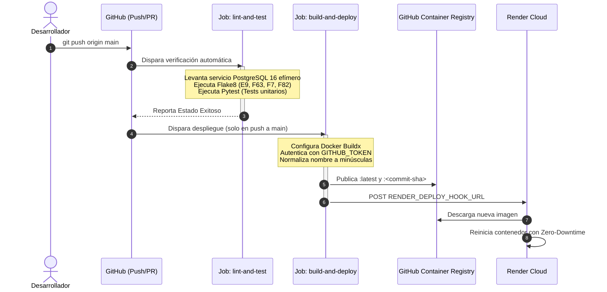

# Guía de Implementación y Despliegue Continuo (CI/CD) — Farmacia Caryvil ERP

Esta guía documenta el estándar de la industria y las mejores prácticas para el aprovisionamiento de infraestructura mediante **Terraform (IaC)** y la entrega continua automatizada mediante **GitHub Actions (CI/CD)** conectada a la plataforma cloud **Render**.

---

## 1. Arquitectura de Despliegue

El flujo integral de entrega continua separa de manera estricta la **Infraestructura como Código (IaC)** de la **Entrega Continua de la Aplicación (CI/CD)**:

```mermaid
flowchart TD
    subgraph Local [Entorno de Desarrollo Local]
        DEV([Desarrollador]) -->|1. Código & Módulos| GIT_BRANCH[Rama Feature / Fix]
        DEV -->|2. Terraform Apply| TF[Terraform CLI]
    end

    subgraph IaC [Aprovisionamiento Cloud (IaC)]
        TF -->|Crea PostgreSQL 16 & Web Service| RENDER_API[(Render API)]
    end

    subgraph GitHub [GitHub Repo & Actions]
        GIT_BRANCH -->|3. Pull Request| PR[PR a main / develop]
        PR -->|Trigger| GHA_TEST[Job: lint-and-test]
        GHA_TEST -->|Flake8 & Pytest con PG Service| TEST_OK{Tests Pasan?}
        TEST_OK -->|Sí| MERGE[Merge a main]
        MERGE -->|4. Push a main| GHA_DEPLOY[Job: build-and-deploy]
        GHA_DEPLOY -->|5. Compila Dockerfile| DOCKER_BUILD[Docker Buildx]
        DOCKER_BUILD -->|6. Push Imagen| GHCR[(GitHub Packages - GHCR)]
        GHA_DEPLOY -->|7. POST Deploy Hook| HOOK_TRIGGER[Render Deploy Hook]
    end

    subgraph Render [Plataforma Render Cloud]
        RENDER_API --> DB[(PostgreSQL 16 Gestionada)]
        RENDER_API --> WEB[Web Service Odoo 17]
        HOOK_TRIGGER -.->|Notifica nueva imagen| WEB
        GHCR -.->|Pull ghcr.io/...:latest| WEB
        WEB <-->|Red Privada Interna :5432| DB
    end
```

---

## 2. Prerrequisitos y Configuración Inicial

### 2.1 Cuentas y Accesos
1. **Cuenta en Render:** Cuenta activa en [render.com](https://render.com).
2. **API Key de Render:** Generada en *Account Settings* > *API Keys*.
3. **Workspace / Team ID:** Identificador `usr-...` o `tea-...` disponible en la URL del Dashboard de Render.
4. **Repositorio GitHub:** Permisos de administrador o mantenedor en `https://github.com/MrTobar04/caryvil-erp`.

### 2.2 Herramientas Locales
* **Terraform CLI:** Versión `>= 1.5.0` ([Descarga oficial](https://developer.hashicorp.com/terraform/install)).
* **Git:** Versión `>= 2.30`.
* **Python:** Versión `3.10` o superior con `pip`.
* **Docker Desktop:** (Opcional para pruebas y builds locales).

---

## 3. Fase 1: Aprovisionamiento de Infraestructura con Terraform (IaC)

Toda la infraestructura se define de forma declarativa en el directorio [infra/terraform/](file:///d:/UDB/CICLO-10-2026/DES/PROYECTO/caryvil-erp/infra/terraform/).

### 3.1 Configuración de Secretos Locales
1. Navega al directorio de Terraform:
   ```powershell
   cd infra/terraform
   ```
2. Crea el archivo de variables reales basándote en la plantilla:
   ```powershell
   cp terraform.tfvars.example terraform.tfvars
   ```
3. Edita `terraform.tfvars` con tus credenciales seguras (este archivo está excluido en `.gitignore` y **nunca** debe subirse a Git):
   ```hcl
   render_api_key      = "rnd_xxxxxxxxxxxxxxxxxxxxxxxxxxxx"
   render_owner_id     = "tea-xxxxxxxxxxxxxxxxxxxx"
   environment         = "dev"
   region              = "oregon"
   db_name             = "caryvil_dev"
   db_user             = "odoo"
   odoo_admin_password = "TuPasswordMaestroUltraSeguro16Chars!"
   ```

### 3.2 Ciclo de Vida de Terraform

| Comando | Propósito | Criterio de Aceptación |
|---|---|---|
| `terraform init` | Descarga el provider `render-oss/render ~> 1.3.0` | Directorio `.terraform/` creado exitosamente. |
| `terraform fmt -check` | Comprueba el formateo canónico HCL | Código de retorno `0` sin archivos pendientes. |
| `terraform validate` | Valida sintaxis, tipos y esquemas del provider | Salida: `Success! The configuration is valid.` |
| `terraform plan` | Calcula el plan de cambios comparando el estado con Render | Muestra los recursos a crear/modificar. |
| `terraform apply` | Aprovisiona los recursos en Render | Crea PostgreSQL y el Web Service. |

### 3.3 Recursos Creados en Render
* **`render_postgres.caryvil_db`:** Base de datos PostgreSQL versión 16, plan `free`, región `oregon`.
* **`render_web_service.caryvil_odoo`:** Contenedor Web Service con runtime `image` apuntando a `ghcr.io/mrtobar04/caryvil-erp:latest`, inyectando automáticamente las variables de conexión interna de PostgreSQL (`HOST`, `PORT`, `USER`, `PASSWORD`, `DB_NAME`, `ADMIN_PASSWORD`, `PROXY_MODE`).

---

## 4. Fase 2: Configuración del Registro de Contenedores (GHCR)

Para que Render pueda descargar la imagen Docker del ERP sin credenciales privadas, el paquete en **GitHub Packages (GHCR)** debe configurarse con visibilidad **Pública**.

### 4.1 Primera Publicación de la Imagen Docker
La imagen debe publicarse al menos una vez para que el Web Service de Render pueda inicializarse.

#### Opción A: Mediante GitHub Actions (Recomendada)
1. En GitHub, ve a la pestaña **Actions**.
2. Selecciona el flujo **CI/CD Pipeline - Farmacia Caryvil ERP**.
3. Haz clic en **Run workflow** seleccionando la rama `main` (o tu rama de trabajo).
4. El pipeline ejecutará las pruebas, compilará el Dockerfile y publicará la imagen en `ghcr.io/mrtobar04/caryvil-erp:latest`.

#### Opción B: Mediante Docker Desktop Local
```powershell
# Iniciar sesión en GitHub Container Registry
docker login ghcr.io -u TU_USUARIO_GITHUB

# Compilar la imagen con el tag del repositorio
docker build -t ghcr.io/mrtobar04/caryvil-erp:latest -f infra/docker/Dockerfile .

# Publicar la imagen
docker push ghcr.io/mrtobar04/caryvil-erp:latest
```

### 4.2 Hacer el Paquete Público en GitHub (Paso Obligatorio)
1. Ingresa a tu perfil u organización en GitHub: `https://github.com/MrTobar04?tab=packages`.
2. Haz clic en el paquete recién publicado: **`caryvil-erp`**.
3. En la barra lateral derecha, haz clic en **Package settings**.
4. Desplázate al fondo hasta la sección **Danger Zone**.
5. Haz clic en **Change package visibility** y selecciona **Public**.
6. Confirma la acción ingresando el nombre del paquete.

> **Importante:** Si el paquete permanece como `Private`, Render rechazará la creación del servicio con el error `lookup error: the provided URL could not be fetched`.

---

## 5. Fase 3: Pipeline Automatizado de CI/CD (GitHub Actions)

El archivo [.github/workflows/ci-cd.yml](file:///d:/UDB/CICLO-10-2026/DES/PROYECTO/caryvil-erp/.github/workflows/ci-cd.yml) implementa las mejores prácticas del estándar DevSecOps.

### 5.1 Estructura del Pipeline



### 5.2 Estándares y Mejores Prácticas Aplicadas en el Pipeline
1. **Principio de Menor Privilegio (`permissions`):** El job de despliegue declara explícitamente solo `contents: read` y `packages: write`, evitando el uso de tokens sobre-privilegiados.
2. **Normalización a Minúsculas:** Los nombres de repositorios en GitHub pueden contener mayúsculas (ej. `MrTobar04`), pero las especificaciones de Open Container Initiative (OCI) y Docker exigen estrictamente nombres en minúsculas. El script normaliza automáticamente el nombre:
   ```bash
   echo "IMAGE_NAME=ghcr.io/$(echo '${{ github.repository }}' | tr '[:upper:]' '[:lower:]')" >> $GITHUB_ENV
   ```
3. **Inmutabilidad y Trazabilidad (Multi-Tagging):** Cada compilación genera dos etiquetas:
   * `:latest`: Para que los servicios siempre descarguen la versión más reciente.
   * `:${{ github.sha }}`: Etiqueta inmutable con el hash exacto del commit para posibilitar rollbacks precisos.
4. **Base de Datos Efímera en Pruebas:** El job `lint-and-test` ejecuta una instancia aislada de `postgres:16-alpine` en la red del runner para validar la integración antes de compilar contenedores.
5. **Activación Manual (`workflow_dispatch`):** Permite disparar el ciclo de prueba y despliegue bajo demanda desde la interfaz de GitHub sin requerir commits vacíos.

---

## 6. Fase 4: Configuración del Deploy Hook en Render

Para que GitHub Actions notifique a Render cada vez que se sube una nueva imagen:

1. Ingresa a [dashboard.render.com](https://dashboard.render.com).
2. Haz clic en el Web Service **`caryvil-erp-dev`**.
3. En el menú lateral, selecciona **Settings**.
4. Desplázate hasta la sección **Deploy Hook**.
5. Haz clic en **Create Deploy Hook** (o copia la URL existente).
   * La URL tiene el formato: `https://api.render.com/deploy/srv-xxxxxxxxxxxxxxxx?key=yyyyyyyy`
6. En tu repositorio de GitHub, ve a **Settings** > **Secrets and variables** > **Actions**.
7. Haz clic en **New repository secret**:
   * **Name:** `RENDER_DEPLOY_HOOK_URL`
   * **Secret:** Pega la URL del Deploy Hook copiada de Render.
8. Guarda el secreto.

A partir de este momento, cada `push` a la rama `main` compilará la imagen en GHCR y ordenará a Render actualizar el contenedor automáticamente.

---

## 7. Fase 5: Verificación Post-Despliegue (Smoke Tests)

Una vez completado el aprovisionamiento y el despliegue automático:

### 7.1 Obtención de la URL Pública
En la terminal dentro de `infra/terraform/`:
```powershell
terraform output odoo_service_url
```
Salida esperada: `https://caryvil-erp-dev.onrender.com`

### 7.2 Verificación de Salud HTTP (Smoke Test)
Ejecuta desde tu terminal:
```powershell
curl -sI https://caryvil-erp-dev.onrender.com
```
* **Respuesta esperada:** Código HTTP `200 OK` o `303 See Other` (redirección al gestor de base de datos o pantalla de login).
* **Cold Start Note:** En el plan gratuito de Render, si la aplicación no recibe tráfico durante 15 minutos, entra en reposo. La primera petición puede demorar entre 30 y 50 segundos mientras el contenedor arranca.

### 7.3 Verificación de Logs en Render
1. En el Dashboard de Render, ingresa al servicio **`caryvil-erp-dev`** y haz clic en **Logs**.
2. Debes observar la secuencia de inicialización del entrypoint:
   ```text
   === [Caryvil ERP] Verificando disponibilidad de PostgreSQL en ...:5432 ===
   === [Caryvil ERP] Base de datos PostgreSQL disponible ===
   ... odoo.modules.loading: loading 1 modules...
   ... odoo.service.server: HTTP service (werkzeug) running on 0.0.0.0:8069
   ```

---

## 8. Estrategia de Rollback y Contingencias

Si un despliegue en producción introduce un error no detectado:

### 8.1 Rollback Rápido por Tag SHA
1. Identifica el commit estable previo en Git (ej. `a1b2c3d`).
2. En Render Dashboard > Web Service > **Settings** > **Docker Image**.
3. Cambia temporalmente la etiqueta de `:latest` a `:a1b2c3d`.
4. Haz clic en **Save Changes**; Render desplegará inmediatamente la imagen inmutable previa en segundos.

### 8.2 Destrucción Limpia de Infraestructura (Ambientes Temporales)
Para dar de baja todos los recursos en Render sin dejar costos ni artefactos huérfanos:
```powershell
cd infra/terraform
terraform destroy -auto-approve
```
Verifica que la salida termine con: `Destroy complete! Resources: 2 destroyed.`
