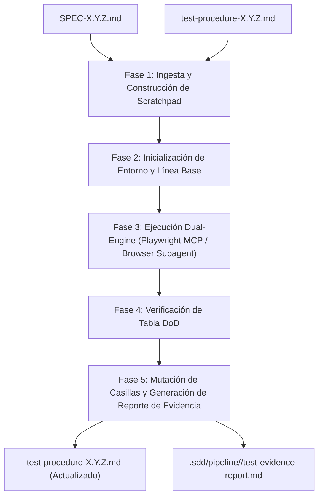

# Guía de Ejecución de Procedimientos de Prueba (Test Procedures)

## 1. Propósito y Visión General

El directorio `docs/test-procedures/` alberga los documentos operativos de prueba de interfaz y manuales correspondientes a cada especificación técnica (`SPEC-X.Y.Z.md`) del proyecto **Caryvil ERP**. 

Dentro del marco de desarrollo basado en especificaciones (**Spec-Driven Development - SDD**), estos procedimientos cumplen una doble función:
1. **Guión Operativo de Prueba Manual:** Proporcionar a evaluadores humanos (Analistas QA, Auditores ISO/NIST o Usuarios de Aceptación UAT) instrucciones precisas paso a paso para validar la funcionalidad desde la interfaz gráfica de usuario.
2. **Contrato de Verificación para Agentes de Automatización:** Servir de especificación de entrada y artefacto de salida para la suite de prueba automatizada (`test-automation`), la cual muta directamente las casillas de verificación (`☐` -> `☑`) tras la ejecución interactiva del navegador.

> [!IMPORTANT]
> **Directiva Zero-Code / Zero-Terminal:** Todos los procedimientos contenidos en esta carpeta están diseñados para ser ejecutados sin necesidad de escribir código, ejecutar scripts en la terminal ni realizar consultas directas a la base de datos durante el proceso de verificación. Toda validación técnica se realiza visualmente mediante la interfaz gráfica del sistema o los paneles de herramientas para desarrolladores del navegador (DevTools).

---

## 2. Convención de Nomenclatura y Estructura de Archivos

Cada archivo de procedimiento de prueba guarda una relación unívoca (1 a 1) con su respectiva especificación técnica.

* **Patrón de Nombre:** `test-procedure-X.Y.Z.md`
* **Ubicación:** `docs/test-procedures/`
* **Referencia Cruzada:** Cada procedimiento enlaza directamente a su especificación de origen en `docs/specs/SPEC-X.Y.Z-[slug].md`.

### Estructura Interna del Documento de Prueba

Todo archivo `test-procedure-X.Y.Z.md` contiene la siguiente estructura estandarizada:

1. **Metadatos del Encabezado:** Referencia a la SPEC, módulo, estado de la especificación, evaluador, fecha y veredicto general (`APPROVED`, `REJECTED`, `BLOCKED`).
2. **Prerrequisitos del Entorno:** Lista de condiciones del sistema, datos de prueba, servicios y accesos requeridos antes de iniciar la ejecución.
3. **Flujos de Prueba (`Test Flow N`):** Derivación directa de los Criterios de Aceptación (`AC-N`). Cada flujo incluye:
   - Pasos de acción y resultado esperado unificados.
   - Sub-escenarios de rutas de error y casos límite (`Edge Cases / Error Paths`).
   - Casilla de resultado del flujo (`PASSED`, `FAILED`, `BLOCKED`) y notas de observación.
4. **Matriz de Verificación Definition of Done (DoD):** Tabla de comprobación de criterios de finalización de la SPEC con instrucciones de validación visual.
5. **Resultados Finales de Sesión:** Resumen numérico de cobertura, veredicto final firmado y registro detallado de defectos encontrados.

---

## 3. Matriz de Sustitución Zero-Code

Para cumplir con la directiva de verificación sin código, las comprobaciones técnicas tradicionales se sustituyen por inspecciones visuales en la interfaz gráfica o en DevTools:

| Verificación Técnica Tradicional | Alternativa Permitida (Zero-Code) |
| :--- | :--- |
| Ejecutar `console.log` o scripts CLI | Abrir DevTools (`F12`) -> Pestaña **Console** -> Inspeccionar mensajes del sistema |
| Consultar API mediante `curl` o Postman | DevTools (`F12`) -> Pestaña **Network** -> Filtrar peticiones `Fetch/XHR` y verificar código HTTP |
| Inspeccionar variables en almacenamiento local | DevTools (`F12`) -> Pestaña **Application** -> **Local/Session Storage** -> Verificar clave-valor |
| Consultar estado de base de datos PostgreSQL | Visualizar registros en las vistas de lista, formularios o paneles KPI de Odoo |
| Revisar archivos de log en el servidor | DevTools (`F12`) -> Pestaña **Console** -> Filtrar por prefijos de servicio (e.g. `[Server]`, `[API]`) |
| Generación de comprobantes o QR en código | Inspeccionar el renderizado gráfico del código QR o documento PDF en la pantalla |

---

## 4. Modalidades de Ejecución

Los procedimientos de prueba pueden ejecutarse en dos modalidades: manual por un evaluador humano o automatizada mediante agentes de software.

### Modalidad 1: Ejecución Manual (Evaluador QA / Auditor)

1. **Preparación del Entorno:**
   - Verifique que la aplicación Caryvil ERP esté en ejecución (localmente en Docker Compose `http://localhost:8069` o en la nube).
   - Inicie sesión con las credenciales indicadas en la sección `Environment Prerequisites` del procedimiento.
   - Abra las Herramientas para Desarrolladores del navegador (tecla `F12` en Chrome/Firefox/Edge).

2. **Ejecución de Flujos de Prueba:**
   - Abra el archivo `docs/test-procedures/test-procedure-X.Y.Z.md` correspondiente.
   - Ejecute secuencialmente cada `Test Flow`.
   - Siga la ruta exacta de navegación especificada en cada paso (menús, pestañas, botones).
   - Valide que el resultado observado en pantalla o en DevTools coincida exactamente con la descripción esperada.

3. **Verificación de Casos Límite:**
   - Pruebe los escenarios indicados en `#### Edge Cases / Error Paths:` provocando las condiciones de error especificadas.
   - Confirme la presencia de mensajes de advertencia, toasts flotantes o validaciones de formulario.

4. **Comprobación de Definition of Done (DoD):**
   - Complete la tabla `Definition of Done (DoD) Verification` validando visualmente cada criterio.

5. **Registro de Veredicto y Firma:**
   - Marque el resultado de cada flujo reemplazando `☐` por `☑` en la casilla correspondiente (`PASSED`, `FAILED` o `BLOCKED`).
   - Complete el encabezado (`Evaluated by`, `Execution Date`, `Overall Result`).
   - En la sección `Session Final Results`, registre el total de flujos ejecutados, aprobados, fallados y el veredicto final. Si se detectan fallos, desglóselos en la sección `Defects found`.

---

### Modalidad 2: Ejecución Automatizada (Workflow `test-automation`)

El pipeline SDD permite ejecutar los procedimientos de forma autónoma mediante el workflow `test-automation` guiado por subagentes y herramientas MCP.

#### Protocolo del Workflow Automatizado:

1. **Ingesta y Scratchpad:** El agente lee la especificación y el procedimiento de prueba, generando un plan determinista de ejecución en `.sdd/pipeline/<spec-id>/test-scratchpad.md`.
2. **Asignación de Motores de Ejecución:**
   - **Playwright MCP (`call_mcp_tool`):** Utilizado para navegación estructurada, rellenado de formularios, verificación de selectores DOM y lectura de `sessionStorage`/`Console`.
   - **Browser Subagent:** Utilizado para interacciones complejas de usuario, validación de animaciones o sesiones de navegación extendidas.
3. **Mutación de Estado del Documento:**
   Al finalizar las verificaciones, el agente edita directamente el archivo `test-procedure-X.Y.Z.md` actualizando el estado de las casillas:
   - Encabezado: `**Overall Result:** ☑ APPROVED  ☐ REJECTED  ☐ BLOCKED`
   - Flujos: `**Result:** ☑ PASSED  ☐ FAILED  ☐ BLOCKED`
   - Tabla DoD: Reemplazo de `| ☐ |` por `| ☑ |`
   - Métricas y veredicto final completados automáticamente.
4. **Artefactos de Evidencia:** El agente genera screenshots de control y guarda el informe consolidado de ejecución en `.sdd/pipeline/<spec-id>/test-evidence-report.md`.

---

## 5. Especificación de Mutación de Casillas de Verificación

Al registrar los resultados en un archivo de procedimiento, se debe seguir estrictamente la siguiente convención de caracteres Markdown:

| Elemento del Documento | Estado Inicial (Pendiente) | Estado Aprobado / Exitoso | Estado Rechazado / Fallido | Estado Bloqueado |
| :--- | :--- | :--- | :--- | :--- |
| **Resultado General (Encabezado)** | `☐ APPROVED  ☐ REJECTED  ☐ BLOCKED` | `☑ APPROVED  ☐ REJECTED  ☐ BLOCKED` | `☐ APPROVED  ☑ REJECTED  ☐ BLOCKED` | `☐ APPROVED  ☐ REJECTED  ☑ BLOCKED` |
| **Resultado por Flujo (`Test Flow`)** | `☐ PASSED  ☐ FAILED  ☐ BLOCKED` | `☑ PASSED  ☐ FAILED  ☐ BLOCKED` | `☐ PASSED  ☑ FAILED  ☐ BLOCKED` | `☐ PASSED  ☐ FAILED  ☑ BLOCKED` |
| **Columna Cumplido en Tabla DoD** | `\| ☐ \|` | `\| ☑ \|` | `\| ☒ \|` (o añadir nota de defecto) | `\| ☐ \|` |
| **Veredicto Final (Sección Final)** | `☐ APPROVED ...` | `☑ APPROVED ...` | `☑ REJECTED ...` | `☑ BLOCKED ...` |

---

## 6. Integración en el Ciclo de Vida del Pipeline SDD

Los procedimientos de prueba de esta carpeta se integran dentro de la arquitectura multi-agente SDD en las siguientes fases:

1. **Pre-Implementación (Fase 1 / Gatekeeper):** El procedimiento puede ser redactado de forma anticipada como un **Contrato UAT**, definiendo los criterios que la implementación deberá cumplir.
2. **Verificación de Calidad (Fase 3 / Tester):** Tras la aprobación de las pruebas unitarias e integración de código por parte de `sdd-developer`, el agente `sdd-tester` invoca `test-automation` sobre el procedimiento target.
3. **Cierre de Especificación (Fase 4 / Releaser):**
   - Si el veredicto en `test-procedure-X.Y.Z.md` es `APPROVED`, el componente se marca como verificado y listo para empaquetado y merge.
   - Si el veredicto es `REJECTED`, el agente `sdd-tester` devuelve la tarea a `sdd-developer` junto con las evidencias registradas en la sección de defectos.

---

## 7. Lista de Control de Calidad del Procedimiento

Antes de dar por concluida la creación o actualización de cualquier archivo en `docs/test-procedures/`, asegúrese de verificar los siguientes puntos:

- [ ] El nombre del archivo sigue exactamente la sintaxis `test-procedure-X.Y.Z.md`.
- [ ] Todos los `Test Flows` derivan directamente de un Criterio de Aceptación (`AC-N`) de la especificación correspondiente.
- [ ] No existen instrucciones de terminal, comandos CLI ni scripts dentro de los pasos de verificación.
- [ ] Cada paso combina de forma unificada la acción del usuario y el resultado esperable.
- [ ] Todos los flujos contienen su sub-sección de casos límite o error (`Edge Cases / Error Paths`).
- [ ] La tabla de verificación DoD contiene instrucciones visuales claras para cada ítem.
- [ ] Las casillas de verificación utilizan los caracteres Unicode estandarizados (`☐`, `☑`, `☒`).
